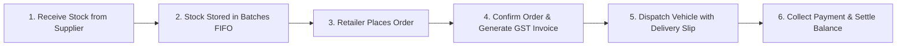

# 📖 WareFlow Business Owner & Staff Handover Guide (`HANDOVER.md`)

> **Welcome to WareFlow!**  
> This guide is written in **plain, simple business language** for warehouse owners, managers, accountants, and floor staff. It explains exactly how to run your day-to-day wholesale business without any technical jargon.

---

## 🧭 Daily Wholesale Flow at a Glance

---

## 🔑 1. Logging In & Securing Your Account

### How to Sign In
1. Open the live web app: **[https://wareflow-web-seven.vercel.app](https://wareflow-web-seven.vercel.app)** on your laptop, tablet, or mobile phone.
2. Click **Continue with Google** or enter your registered work email and password.
3. If logging in for the first time as Owner, the system automatically configures your admin privileges.

### Setting Up 2-Factor Authentication (2FA) for Security
To protect financial transactions and invoices:
1. Click your profile avatar at the top right → select **Security & 2FA**.
2. Click **Enable Two-Factor Authentication**.
3. Open **Google Authenticator** or **Microsoft Authenticator** on your smartphone.
4. Scan the QR code shown on the screen.
5. Type the 6-digit code shown in your app to activate.
6. **Save your 10 Emergency Recovery Codes** in a safe notebook. If you ever lose your phone, any one of these codes allows instant login.

---

## 📦 2. Adding Products & Managing Dual Units of Measure

### Adding a New Product
1. Go to **Catalog → Products** from the left navigation bar.
2. Click **+ Add Product**.
3. Fill in:
   - **Product Name**: (e.g. `Tata Salt 1kg`)
   - **SKU / Barcode**: (e.g. `TS-1KG` or scan with your barcode scanner)
   - **HSN Code**: 8-digit GST commodity code (e.g. `25010010`)
   - **GST Slab**: Select 0%, 5%, 12%, 18%, or 28%
   - **Wholesale Selling Price**: Price charged to kirana stores (e.g. ₹28.00)
   - **Cost Price**: Price purchased from supplier (e.g. ₹22.50)
   - **Reorder Threshold**: Minimum safety quantity before the system alerts you (e.g. 100 packets).
4. Click **Save Product**.

### Handling Boxes & Cases (Dual UoM)
If you buy in **Cases (Cartons)** and sell in **Pieces (Packets)**:
- Select Base Unit: `Piece`
- Add Conversion: `1 Case = 24 Pieces`
- The system automatically allows you to enter purchase orders in Cases and sales orders in Pieces with instant math!

---

## 🚚 3. Receiving Deliveries from Suppliers (GRN & Batches)

When a truck arrives at your warehouse with fresh inventory:
1. Go to **Procurement → Purchase Orders**.
2. Select the matching Purchase Order and click **Receive Goods (GRN)**.
3. Enter:
   - **Batch Number**: printed on the manufacturer's carton (e.g. `B-2026-08`)
   - **Quantity Received**: (e.g. 50 Cases)
   - **Expiry Date**: (e.g. `15-Aug-2027`)
   - **Warehouse Location**: (e.g. `Bhiwandi Central Hub - Bay A3`)
4. Click **Confirm Receipt**.
5. **What happens automatically**:
   - Stock is immediately added to your live inventory.
   - The batch is queued in **FIFO order** (First-In, First-Out), ensuring your warehouse staff always picks the oldest batch first so nothing expires on the shelf.

---

## 🏪 4. Onboarding Retailers & Setting Credit Limits

Before selling goods on credit:
1. Go to **Customers → Retailers**.
2. Click **+ Add Retailer**.
3. Enter:
   - **Store Name**: (e.g. `Aapla Supermarket`)
   - **Owner Contact**: Phone number & WhatsApp number
   - **GSTIN**: 15-character GST number (auto-validates state code)
   - **Assigned Credit Limit**: Maximum unpaid balance allowed (e.g. `₹50,000`).
4. Click **Save Retailer**.
- **Credit Protection**: If the retailer owes ₹45,000 and places a new order for ₹8,000, WareFlow will alert you that they exceed their limit by ₹3,000 and require manager approval before goods leave the building.

---

## 🧾 5. Raising a Sales Order & Generating a GST Invoice

When a retailer calls or visits to place an order:
1. Go to **Sales → New Sales Order**.
2. Select the **Retailer** from the dropdown.
3. Add items to the order:
   - Search by typing product name or scanning barcode.
   - Enter quantity in pieces, boxes, or cases.
4. Review the GST breakdown (CGST + SGST or IGST).
5. Click **Confirm Order**.
   - Stock is instantly deducted from your oldest inventory batches.
6. Click **Generate Tax Invoice**.
7. Click **Download PDF**:
   - Downloads a formal, GST-compliant tax invoice with B2B QR Code, HSN summary, and bank NEFT/UPI payment details.
   - You can print this invoice or click **Share on WhatsApp** to send it directly to the store owner's phone.

---

## 💳 6. Recording Payments & Settling Invoices

When a retailer pays you (via UPI, Bank Transfer, Cheque, or Cash):
1. Go to **Billing → Invoices**.
2. Click on the invoice number (e.g. `INV-2026-004`).
3. Click **Record Payment**.
4. Enter:
   - **Amount Received**: (e.g. `₹10,000` against a ₹25,000 bill)
   - **Payment Method**: Select `UPI`, `Bank Transfer / NEFT`, `Cheque`, or `Cash`
   - **Transaction Reference / UTR**: (e.g. `UPI-948271039`)
5. Click **Save Payment**.
- **What happens automatically**:
  - The invoice status updates to **Partially Paid** (or **Paid** if full amount settled).
  - The retailer's outstanding debt balance immediately decreases by ₹10,000, freeing up their credit limit for future orders.
  - **Overpayment Guard**: You can never accidentally record more than the remaining balance.

---

## 🔄 7. Handling Returns & Issuing Credit Notes

If a retailer returns expired, damaged, or unsold items:
1. Go to **Sales → Returns**.
2. Click **+ New Return**.
3. Select the original Sales Order and choose the returned SKU and quantity.
4. Select Return Reason: `Damaged in Transit`, `Expired Stock`, or `Customer Return`.
5. Click **Issue Credit Note**.
- The credit note reduces the retailer's balance or applies credit towards their next invoice.

---

## 🚛 8. Delivery Logistics & Proof of Delivery (POD)

For your delivery drivers and tempo operators:
1. Go to **Logistics → Deliveries**.
2. Click **Assign Vehicle / Driver** and choose pending orders for the route.
3. When the driver arrives at the kirana store:
   - Open the delivery on mobile.
   - Click **Collect Proof of Delivery**.
   - Retailer signs directly on the smartphone screen or the driver uploads a photo of the received cartons.
   - Delivery status changes to **Delivered**.

---

## 📊 9. Reading the Owner Executive Dashboard & AR Aging

### Executive Dashboard
- Open **Dashboard** from the left menu.
- **Top Metrics**:
  - **Today's Revenue**: Total sales closed today.
  - **Inventory Valuation**: Current physical stock value at wholesale and cost price.
  - **Overdue Receivables**: Total money owed to you past the 30-day payment term.
  - **Fastest-Moving SKUs**: Top 5 bestsellers this week.

### Accounts Receivable (AR) Aging Report
Go to **Analytics → AR Aging**:
- **0–30 Days (Green)**: Fresh invoices within normal credit terms.
- **31–60 Days (Yellow)**: Due for follow-up — click **Send WhatsApp Reminder**.
- **61–90 Days (Orange)**: Urgent collection required.
- **90+ Days (Red)**: Critical overdue — new credit sales should be blocked.
- Click **Export to Excel (.xlsx)** to download a complete ledger for your accountant.

---

## 🔔 10. What the Alerts & Bell Icon Mean

Look at the **Bell Icon** in the top navigation bar:
- 🔴 **Red Alert**: Stock has fallen below your configured Reorder Point! Click to see suggested reorder quantities.
- 🟡 **Yellow Alert**: A batch is expiring within 30 days! Discount or return to manufacturer.
- 🔵 **Blue Alert**: Retailer payment has become overdue past 30 days.

---

## 📱 11. Offline Mode & Mobile App Use (PWA)

WareFlow is a **Progressive Web App (PWA)**:
1. Open Chrome on your Android or Safari on your iPhone.
2. Tap **Settings (three dots) → Add to Home Screen**.
3. WareFlow installs as an app on your phone with an app icon.
4. **Offline Resilience**: Even if warehouse Wi-Fi drops, you can continue browsing stock levels and scanning items; changes automatically sync back up when your connection returns!

---

## 📞 Support & Contacts

If you ever encounter an issue or have a business question:
- **Emergency Database Backup**: Backups run automatically every day at 02:00 UTC (07:30 AM IST).
- **System Health Status**: [https://wareflow-api-kg2c.onrender.com/health](https://wareflow-api-kg2c.onrender.com/health) (200 OK).
- **Admin Inquiries**: Contact your designated system administrator.
