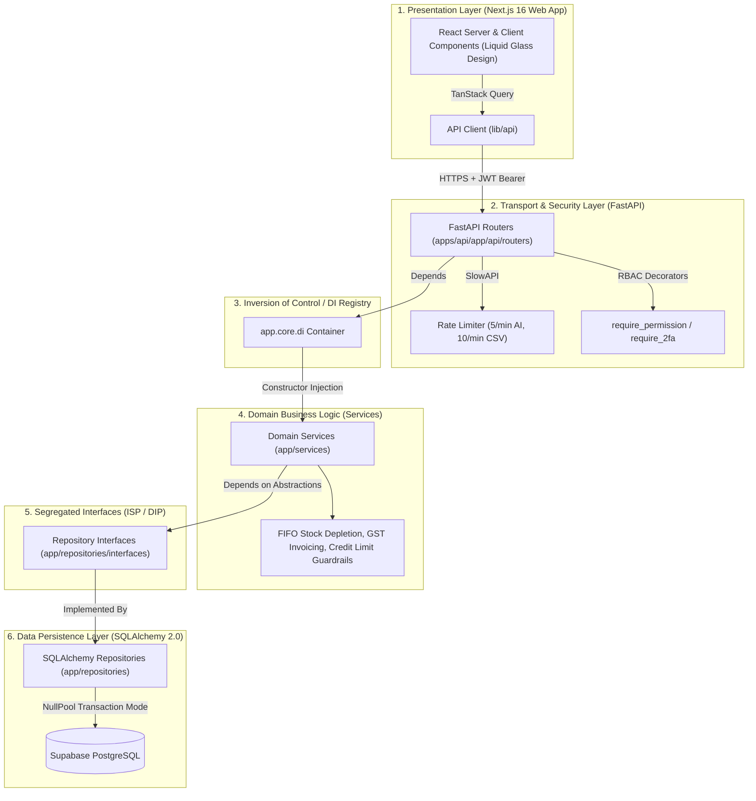

# ⬢ WareFlow — Enterprise Wholesale & Agro ERP

[](https://github.com/Kaavin-Khatri/Wareflow/actions/workflows/ci.yml)
[](https://github.com/Kaavin-Khatri/Wareflow/actions/workflows/database-backup.yml)
[](LICENSE)
[](https://nextjs.org/)
[](https://fastapi.tiangolo.com/)
[](https://supabase.com/)

**WareFlow** is an agentic, offline-first wholesale inventory and ERP management system tailored for Indian FMCG and Agro-commodity distributors. It manages end-to-end B2B operations: dual UoM conversions (piece/kg/case), FIFO batch tracking with FSSAI expiry gates, GST tax invoicing with e-Way bill compliance, credit limit risk controls, aged receivables (AR) tracking, proof-of-delivery logistics routing, and AI demand forecasting — operating seamlessly on a **$0 infrastructure footprint**.

---

## 🌐 Live Production Deployment

| Component           | Production URL                                                                       | Provider & Region                   | Hosting Tier       |      Status       |
| :------------------ | :----------------------------------------------------------------------------------- | :---------------------------------- | :----------------- | :---------------: |
| **Web Frontend**    | **[https://wareflow-web-seven.vercel.app](https://wareflow-web-seven.vercel.app)**   | Vercel (Global Edge)                | Hobby ($0)         | ✅ **100% Live**  |
| **FastAPI Backend** | **[https://wareflow-api-kg2c.onrender.com](https://wareflow-api-kg2c.onrender.com)** | Render (`ap-southeast-1` Singapore) | Free 512MB ($0)    | ✅ **100% Live**  |
| **Database**        | Supabase PostgreSQL 16                                                               | Supabase (`ap-northeast-2` Seoul)   | Free t3a.nano ($0) | ✅ **Connected**  |
| **Auth System**     | Firebase Authentication                                                              | Google Cloud Identity Platform      | Free Spark ($0)    | ✅ **Configured** |

---

## 🏛️ System Architecture & SOLID Principles

WareFlow enforces a strict **Hexagonal / Clean Architecture** across all 9 core wholesale domains. API routers serve strictly as HTTP protocol gateways (Single Responsibility Principle) with zero database queries, delegating domain logic to Services that depend only on abstract Repository Interfaces (Dependency Inversion Principle).



### Why Layered SOLID Design?

1. **S — Single Responsibility Principle (SRP)**: Routers handle HTTP status codes and serialization; Services manage business logic; Repositories handle database interactions.
2. **O — Open/Closed Principle (OCP)**: Subsystems are extensible without editing core code. Verified by [`apps/api/tests/test_solid_ocp_proofs.py`](file:///c:/Users/khatr/Documents/GitHub/Wareflow/apps/api/tests/test_solid_ocp_proofs.py):
   - **Pricing Plugin**: Extend wholesale volume discounts without modifying base `Product` models.
   - **Notification Plugin**: Plug in Slack/Webhook dispatchers without modifying `AlertEngine`.
   - **Forecasting Plugin**: Swap Holt-Winters / Exponential Smoothing algorithms into `ForecastingService`.
   - **Dynamic RBAC Plugin**: Register custom roles and permissions at runtime without touching auth middleware.
3. **L — Liskov Substitution Principle (LSP)**: Mock and database repositories substitute parent protocols transparently.
4. **I — Interface Segregation Principle (ISP)**: Narrow, role-specific interfaces (`ProfileRepository`, `PaymentRepositoryInterface`).
5. **D — Dependency Inversion Principle (DIP)**: `grep` confirms **zero** routers import a database repository directly.

---

## 💰 Runs on $0 Infrastructure

Every component runs entirely within generous free-tier allowances:

| Service            | Role                                      | Provider       | Free Tier Limit                          | Production Usage          |      Cost      |
| :----------------- | :---------------------------------------- | :------------- | :--------------------------------------- | :------------------------ | :------------: |
| **Vercel**         | Next.js Frontend & Edge Hosting           | Vercel         | 100 GB bandwidth, Unlimited builds       | ~1.2 GB/mo                |     **$0**     |
| **Render**         | FastAPI Backend Application               | Render         | 750 free instance hours/month            | 1 instance (Singapore)    |     **$0**     |
| **Supabase**       | PostgreSQL System of Record               | Supabase       | 500 MB DB storage, 1 GB file storage     | ~42 MB DB, ~15 MB backups |     **$0**     |
| **Firebase**       | Identity, Phone OTP, & Firestore Realtime | Google Cloud   | 50k monthly active users, 10k phone auth | < 100 users               |     **$0**     |
| **Resend**         | Transactional & Alert Emails              | Resend         | 3,000 emails/month (100/day)             | ~150 emails/mo            |     **$0**     |
| **Meta WhatsApp**  | B2B Dispatch & Alert Notifications        | Meta Cloud API | 1,000 service conversations/month        | ~200 convs/mo             |     **$0**     |
| **Twilio / SMS**   | Critical Fallback SMS                     | Twilio         | Free trial credit                        | Emergency fallback only   |     **$0**     |
| **Google Places**  | Retail Lead Discovery Scanner             | Google Cloud   | $200 recurring monthly credit            | ~~150 requests/mo (~~$3)  |     **$0**     |
| **Groq Cloud**     | LLaMA-3.3 70B AI Insights & Forecasts     | Groq           | 30 requests/minute free                  | ~50 requests/day          |     **$0**     |
| **GitHub Actions** | CI/CD & Automated Daily DB Backups        | GitHub         | 2,000 free runner minutes/month          | ~180 minutes/mo           |     **$0**     |
| **TOTAL**          |                                           |                |                                          |                           | **$0.00 / mo** |

---

## ⚡ Quick Start & Local Development

### Prerequisites

- **Node.js**: `>= 20.0.0`
- **pnpm**: `>= 9.0.0`
- **Python**: `>= 3.11.0` (Python 3.12 recommended)
- **Git**

### 1. Clone Repository & Install Dependencies

```bash
git clone https://github.com/Kaavin-Khatri/Wareflow.git
cd Wareflow

# Install Frontend Monorepo Dependencies
pnpm install

# Setup Backend Virtual Environment
cd apps/api
python -m venv .venv

# Activate Virtual Environment (Windows PowerShell)
.\.venv\Scripts\Activate.ps1
# Or macOS/Linux: source .venv/bin/activate

# Install Python Backend Dependencies
pip install -r requirements.txt
pip install -r requirements-dev.txt
cd ../..
```

### 2. Configure Environment Variables

```bash
# Frontend Environment
cp apps/web/.env.example apps/web/.env.local

# Backend Environment
cp apps/api/.env.example apps/api/.env
```

### 3. Seed Demo Data & Run Services

```bash
# Seed wholesale catalog, warehouses, suppliers, retailers, and stock batches
python scripts/seed.py

# Terminal 1: Run Next.js Frontend (:3000)
pnpm dev:web

# Terminal 2: Run FastAPI Backend (:8000)
cd apps/api
uvicorn app.main:app --reload --port 8000
```

- **Web App**: Open [http://localhost:3000](http://localhost:3000)
- **API Swagger Docs**: Open [http://localhost:8000/docs](http://localhost:8000/docs)
- **Health Check**: `curl http://localhost:8000/health` → `{"status": "ok"}`

---

## 🧪 Testing & Quality Assurance

```bash
# Run Full Backend Pytest Suite (337 Tests)
cd apps/api
pytest --cov=app -v

# Run Frontend Vitest Suite (233 Tests)
pnpm test:web

# Full Production Build Check
pnpm build:web
```

- **Backend Pytest Baseline**: 337 tests passing (100% green).
- **Frontend Vitest Baseline**: 233 tests passing across 25 component/hook test suites.
- **Production Routes**: 55 Next.js App Router pages compiling cleanly.

---

## 📚 Documentation Directory

- [`docs/ARCHITECTURE.md`](file:///c:/Users/khatr/Documents/GitHub/Wareflow/docs/ARCHITECTURE.md) — Comprehensive SOLID layering spec & Mermaid architecture diagram.
- [`docs/HANDOVER.md`](file:///c:/Users/khatr/Documents/GitHub/Wareflow/docs/HANDOVER.md) — Plain-language operating manual for warehouse owners and staff.
- [`docs/DISASTER_RECOVERY.md`](file:///c:/Users/khatr/Documents/GitHub/Wareflow/docs/DISASTER_RECOVERY.md) — Automated database backup, 14-day retention & tested recovery runbook.
- [`docs/SMOKE.md`](file:///c:/Users/khatr/Documents/GitHub/Wareflow/docs/SMOKE.md) — 11-step human click-path smoke test protocol.
- [`codebase_audit.md`](file:///c:/Users/khatr/Documents/GitHub/Wareflow/codebase_audit.md) — Master living registry of endpoints, schemas, environment variables, and security controls.
- [`memory.md`](file:///c:/Users/khatr/Documents/GitHub/Wareflow/memory.md) — Complete historical engineering ledger and decision log.

---

## 📄 License

Private Commercial ERP — All Rights Reserved.
