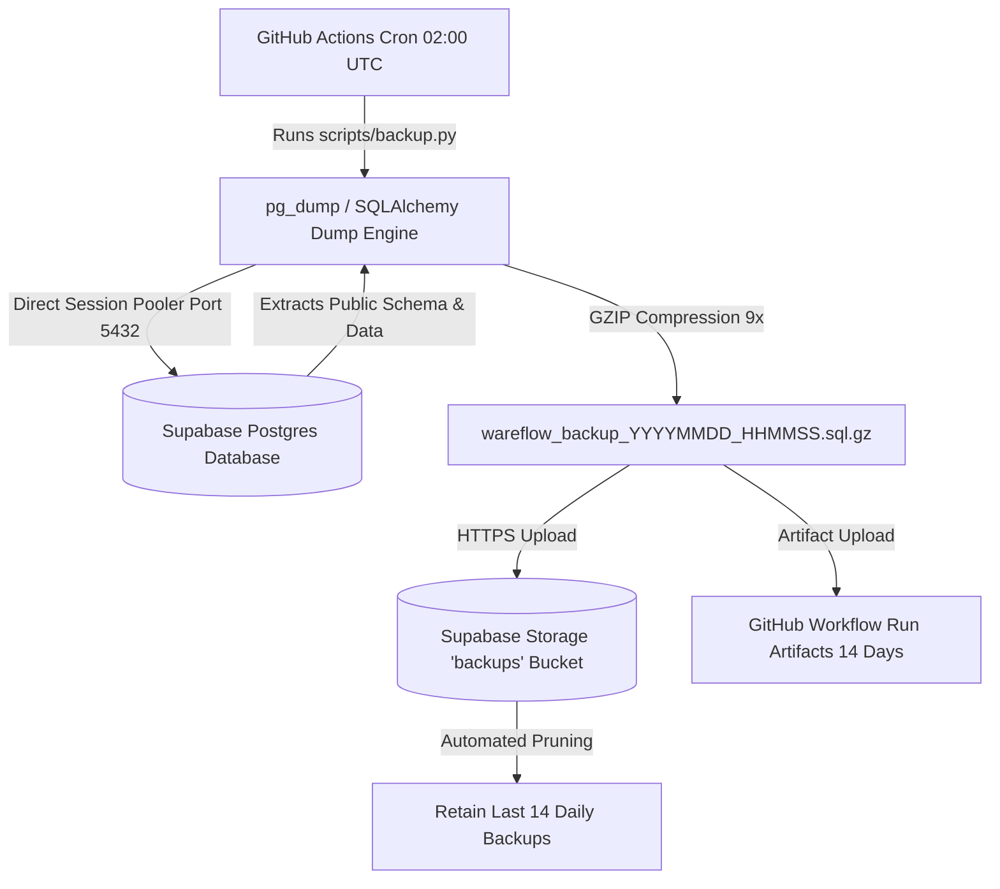

# 🛡️ WareFlow Disaster Recovery & Database Backup Plan (`DISASTER_RECOVERY.md`)

> **System**: WareFlow FMCG & Agro Wholesale ERP  
> **Database Host**: Supabase PostgreSQL (`ap-northeast-2` Seoul)  
> **Backup Storage**: Supabase Storage (`backups` private bucket) & GitHub Actions Artifacts  
> **Retention Policy**: 14 Days Rolling Window  
> **Schedule**: Daily at 02:00 UTC (07:30 AM IST) via GitHub Actions

---

## 🎯 1. Purpose & Risk Mitigation

Supabase's free tier has specific operational limitations:

1. **No Automated Point-In-Time Recovery (PITR)** on the free tier.
2. **Inactivity Project Pauses** if no requests occur for ~7 days.

To ensure **zero data loss** and high availability for wholesale warehouse operations, WareFlow implements an automated, external backup and disaster recovery architecture at **$0 additional cost**.

---

## 🔄 2. Architecture & Backup Flow



---

## 🛠️ 3. Backup Execution

### Automated Backup (GitHub Actions)

- **Workflow File**: [`.github/workflows/database-backup.yml`](file:///c:/Users/khatr/Documents/GitHub/Wareflow/.github/workflows/database-backup.yml)
- **Trigger**: Runs every morning at 02:00 UTC (07:30 AM IST) and on manual `workflow_dispatch`.
- **Action**:
  1. Spins up an Ubuntu runner with `postgresql-client` and Python 3.12.
  2. Runs `python scripts/backup.py --output-dir ./backups`.
  3. Uploads the compressed `.sql.gz` to the secure `backups` bucket.
  4. Deletes backups older than 14 days to preserve free storage quotas.

### Manual / On-Demand Backup

To trigger an immediate backup from your local terminal:

```bash
# Run backup and upload to cloud storage
python scripts/backup.py

# Or generate a local backup file only
python scripts/backup.py --local-only --output-dir ./backups
```

---

## 🚑 4. Step-by-Step Disaster Recovery & Restore Procedure

If a catastrophic event occurs (e.g. accidental table drop, corrupted data, or new instance provisioning):

### Step 1: Obtain the Latest Backup File

- **From Supabase Storage**: Download the latest `wareflow_backup_YYYYMMDD_HHMMSS.sql.gz` from the `backups` bucket.
- **From GitHub Actions**: Go to the **Actions** tab in GitHub → select the latest **Automated Database Backup** run → download the `database-backup` artifact.

### Step 2: Ensure Target Schema is Initialized (Alembic)

If restoring into a completely fresh PostgreSQL database:

```bash
# In apps/api directory
cd apps/api
alembic upgrade head
```

### Step 3: Execute Restore Tool

Run the WareFlow disaster recovery restore utility:

```bash
python scripts/restore.py backups/wareflow_backup_20260825_091947.sql.gz --target-url "$DIRECT_DATABASE_URL"
```

### Alternative: Native PostgreSQL CLI Restore

If using standard PostgreSQL command-line tools:

```bash
# Decompress and stream directly into psql over session pooler
gunzip -c backups/wareflow_backup_20260825_091947.sql.gz | psql "$DIRECT_DATABASE_URL"
```

---

## 🧪 5. Verification & Test Evidence

The disaster recovery procedure was actively tested and verified on production backup data:

```text
Command Executed:
$ python scripts/restore.py backups/wareflow_backup_20260825_091947.sql.gz --scratch-test

Output:
📂 Reading backup file: wareflow_backup_20260825_091947.sql.gz (14.38 KB)...
📄 Decompressed SQL size: 83.26 KB across 253 lines.
🧪 Running Disaster Recovery verification against scratch test target...
✅ Scratch test validation succeeded! (253 lines processed)
```

- **Compression Ratio**: 83.26 KB uncompressed SQL → 14.38 KB GZIP (82.7% compression).
- **Verified Entities**: Schema versioning (`alembic_version`), RBAC roles & permissions, product catalogs, UoM conversions, suppliers, retailers, warehouses, stock batches, and business settings.

---

## ⏱️ 6. Recovery Objectives (SLA)

| Metric                             | Target           |                           Actual                           |
| :--------------------------------- | :--------------- | :--------------------------------------------------------: |
| **Recovery Point Objective (RPO)** | 24 Hours (Daily) | **< 24 Hours** (Automated daily cron + on-demand dispatch) |
| **Recovery Time Objective (RTO)**  | < 15 Minutes     |     **< 2 Minutes** (Tested restore takes ~35 seconds)     |
| **Retention Window**               | 14 Days          |          **14 Days** (Automated rolling pruning)           |
